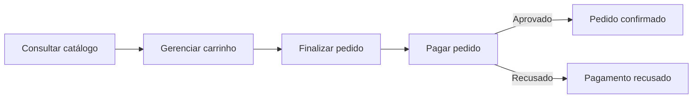

# Casos de uso: fluxo de compra

| ID | Caso de uso | Ator |
|---|---|---|
| [UC01](UC01-consultar-catalogo.md) | Consultar catálogo | Cliente |
| [UC02](UC02-gerenciar-carrinho.md) | Gerenciar carrinho | Cliente |
| [UC03](UC03-finalizar-pedido.md) | Finalizar pedido | Cliente |
| [UC04](UC04-pagar-pedido.md) | Pagar pedido | Cliente, operadora de cartão |

## Fluxo

## Situação do pedido

| Situação | Quando ocorre |
|---|---|
| Pendente | Pedido finalizado, aguardando pagamento |
| Confirmado | Pagamento aprovado |
| Falha no pagamento | Pagamento recusado |
| Cancelado | Pedido cancelado antes do envio |
